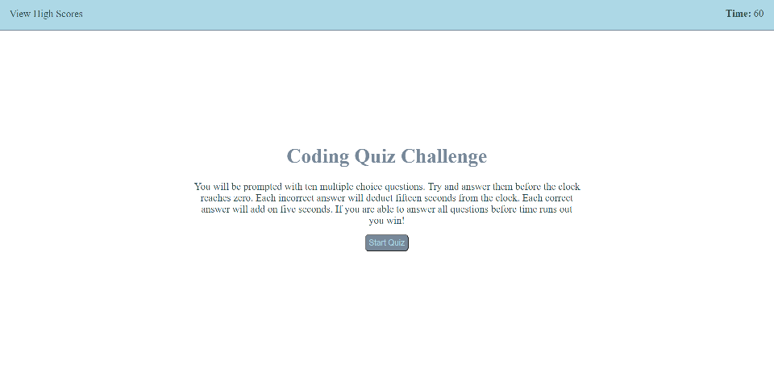
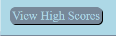

# CodeQuiz

## Description

This website is a quiz on the basics of JavaScript.  If the user is able to answer all questions before time runs out they win the game.  If the users time is one of the five best, they are prompted for their initials and it is added to high scores. 

## Table of Contents

* [Image of Index.html](#Image-of-Index.html)
* [The Quiz](#The-Quiz)
* [End Game](#End-Game)
* [View High Score](#View-High-Score)

## Image of Index.html

Here is an image of the rendered index.html file:

## The Quiz

Upon hitting the start quiz button the user is give ten questions they must answer before the timer runs out.  The timer is set to 60 seconds.  When a question is answered correctly the user will here a ding and and correct will be displayed in green.  Also, the clock will be incremented by 5 seconds. With each incorrect answer the user will hear a buzzer and incorrect wll be displayed in red. Also,  the clock will be decremented by 15 seconds.

Start Quiz Button:

Correct Answer:

Incorrect Answer:

## End Game

The Game is won when the user answers all of the questions before time runs out.   If the user time is one of the five highest they are prompted for their initials.  Their initials and time will then be added to the high score board.  There is validation to ensure the user enters initials.

Enter Initials:

## View High Score

In the upper-left corner of the screen is a link to high scores.  When the user hovers over the link its CSS changes to make it look like a button. With the high scores are two buttons. One allows the user to go back to the quiz start screen.  The other clears high scores.

View High Score Link:

View High Score when Hovered:

High Scores:

